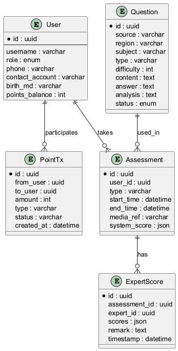

# 用户故事（含验收标准与任务拆分）

以下为 P0 用户故事的扩展版，包含验收标准（AC）与建议拆分任务（Task）。

## 学员注册并获得初始贡献分（P0）
- 描述：学员通过用户名/密码注册账号，注册成功后自动获得 1000 贡献分。
- 验收标准：
  - AC1: 支持用户名+密码注册接口，返回 201。
  - AC2: 注册后的用户记录存在数据库，`points_balance == 1000`。
  - AC3: 密码以安全哈希形式存储，接口不返回明文密码。
- 拆分任务：
  1. API：`POST /auth/register`（实现输入校验、哈希、写 DB）。
  2. DB：`users` 表字段确认（`hashed_password`, `points_balance`）。
  3. 测试：单元测试覆盖注册成功/用户名已存在/输入校验场景。

---

**系统 ER 图预览**

## 管理员用户管理（P0）
- 描述：管理员可以对系统用户进行增删改查，并能查看操作日志。
- 验收标准：
  - AC1: 管理员可 CRUD 用户（受权限控制）。
  - AC2: 每次管理操作生成操作日志记录（who/what/when）。
- 拆分任务：
  1. 权限框架：实现至少 role 字段与简单 RBAC 检查。
  2. API：`/admin/users` CRUD 路由。
  3. 日志：新增操作日志表与写入逻辑。

## 试题批量导入（P0）
- 描述：支持 Excel/CSV 导入试题并进入审核队列。
- 验收标准：
  - AC1: 导入支持模板并可映射字段。
  - AC2: 导入后题目默认状态为 `pending_review`。
- 拆分任务：
  1. API：`POST /admin/questions/import`（文件上传与解析）。
  2. 后端：批处理导入逻辑、错误报告。
  3. 前端/模板：提供导入模板文档。

（其余用户故事可按此格式继续拆分）
